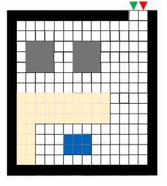

# Single Agent Floor Cleaning Robot
## Problem:
A robot is going to clean an office. However, this robot has no prior knowledge of office layout. The robot equips sensors to perfectly sense the status of 4 immediate neighboring grids (left, right, up, down) and move accordingly. The black grids are prohibited to enter (i.e. wall). The robot has memory to store the grids being visited and being sensed, with relative position to the entry point to from its own reference (i.e. map).

## Solution:
Here, we are going to consider the office as a 2D grid array.Since this robot has no prior knowledge of the office layout as in the grid array, that means it does not know the size of the array, the starting point and the ending point.

Robot can move only 4 directions left, right, up, down.

In the grid some obstacles has been placed , robot has to clean other cells with no obstacles.

Here, the robot, agent has an environment where he has several states to explore. To clean the office he has to go to each of those states once at least. He has 4 available actions to choose, left, right, top or bottom. When he will reach any state s, using action a, he will be provided with reward from the environment. If he can clean that state he will get positive reward, if he will reach any state which is already clean he will get negative reward. So the agent is interacting with the environment with a feedback system.

The agent will be in a MDP where he will try to accumulate the highest possible reward, as in to clean the room as much as he can without going the same state twice. Since the environment and the state action action transition probabilities is still unknown to the agent, we can implement the Q learning algorithm to solve this.

I will develop a Q matrix where all the rows will be the states and all the columns will be the actions. Initially this matrix will be initialized as zeros. Then we will observe the reward value for each of state and actions, then the matrix will be updated accordingly using Bellman equation,

Here s is the present state, a is the action that is taken by the agent from the current state, St+1 is the next state, Rt is the reward which the agent get for choosing action a and γ is the discount factor.

A discount factor is a constant which determines how much the agent giving importance to the future reward. The value can be 0 to 1, so a value close to 1 means the agent is considering the long term rewards, where a value close to 0 means the agent is considering the short term rewards, means the immediate rewards.

So the agent will pick a state and will take an action, then next state, and so on. In this way when he will reach the final state it will complete one episode. We will iterate the same process for several episodes and for each episode, and for every transition from one state to another it will continue to update the Q matrix.

Environment:
Let’s consider all the walls are 1, all the obstacles are 2, start point is 3 and end point is 4. All the rest of the cells are represented as 0. The visited(cleaned cells) will be represented by 5. In this scenario the robot has to move along the room and has to clean those ‘0’ cells.

Reward:
Now I am going to assign some reward value for the robot.

➢ If it goes to any ‘0’ cell, it will get 100 reward since it is cleaning that cell. I am putting higher reward for this step since it will encourage the robot to clean more.

➢ If it goes to any cell which is already visited, then it will get -10 reward, which will prevent
the robot to go any visited cell again.

➢ For the wall and obstacle I putting -inf reward so that the robot can never choose that cell.

➢ And for starting cell it will get  10. And for ending cell it will get 100 reward, so that the robot chose that end cell at the very last step.

Action:
The robot can move in 4 directions only, left, right, up, down. These are 4 actions possible for that robot from any cell.

Goal:
The goal of this project is to start from starting cell and visit all the cells( with no obstacles) with minimum steps and return to the end cell. The minimum steps it requires, the better the performance, the higher the reward value it will accumulate.

## Output Visualization:

